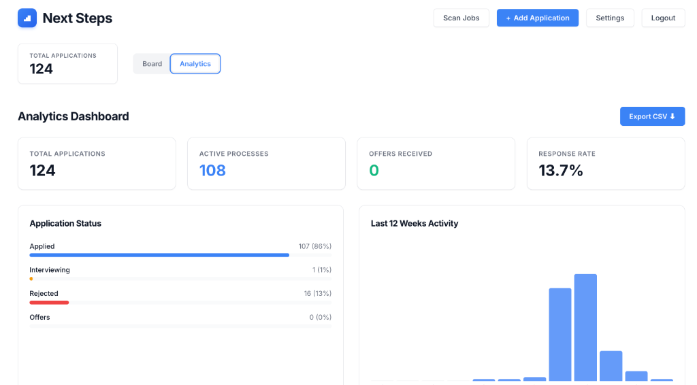

# NextSteps - Job Application Tracker

NextSteps is a full-stack application for tracking job applications using a Kanban-style board. It integrates with Gmail to parse application statuses using Gemini AI.

## Features

- **Kanban Board**: Drag-and-drop interface to manage job applications.
- **Email Scanning**: Automatically scans Gmail for job application updates.
- **AI Powered**: Uses Google Gemini to extract company names and statuses from emails.
- **Analytics**: Visualization of application progress.

## Screenshots


*Manage your job applications with a drag-and-drop Kanban board.*


*Track your progress with detailed analytics.*

## Project Structure

For a detailed explanation of every file in the codebase, see [FILE_STRUCTURE.md](FILE_STRUCTURE.md).

## Prerequisites

- [Python 3.10+](https://www.python.org/)
- [Node.js 18+](https://nodejs.org/)
- [PostgreSQL](https://www.postgresql.org/)

## Setup

### 1. Clone the repository

```bash
git clone <repository-url>
cd NextSteps
```

### 2. Environment Configuration

Create a `.env` file in the root directory by copying the example:

```bash
cp .env.example .env
```

Open `.env` and fill in the following values:

- `DATABASE_URL`: Your PostgreSQL connection string.
- `GOOGLE_CLIENT_ID`: OAuth Client ID from Google Cloud Console.
- `GOOGLE_CLIENT_SECRET`: OAuth Client Secret from Google Cloud Console.
- `GOOGLE_REDIRECT_URI`: `http://localhost:8000/auth/callback` (for local).
- `GEMINI_API_KEY`: API Key from Google AI Studio.
- `FRONTEND_URL`: `http://localhost:5173` (for local).
- `RENDER_EXTERNAL_URL`: (Optional, for production) URL of your deployed backend.

### 3. Backend Setup

```bash
cd backend
python3 -m venv venv
source venv/bin/activate
pip install -r requirements.txt
```

### 4. Frontend Setup

```bash
cd ../frontend
npm install
```

## Running the Application

You can use the provided helper script to start both servers:

```bash
# From the root directory
chmod +x start.sh
./start.sh
```

## Deployment

For detailed deployment instructions on Render.com, please refer to [DEPLOYMENT.md](DEPLOYMENT.md).

Or run them manually:

**Backend:**
```bash
cd backend
source venv/bin/activate
uvicorn main:app --reload
```

**Frontend:**
```bash
cd frontend
npm run dev
```

The frontend will be available at http://localhost:5173 and the backend API at http://localhost:8000.
